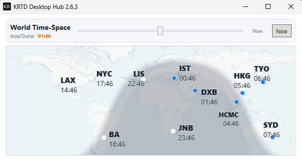

# World Time-Space Widget

A compact world-clock surface for **KR Desktop Hub**: one glance for global work rhythm, local time context, and the moving day-night boundary across markets and cities.



## What it does

**World Time-Space** turns a small desktop widget into a live global time dashboard.

It supports two views:

| View | Purpose |
|---|---|
| **Map mode** | Shows curated cities on a world map with the real day/night shadow. |
| **City-list mode** | Shows the same cities as compact cards for quick scanning. |

Switch between them by double-clicking the **World Time-Space** title.

## Current release

```text
Widget: KR World Time-Space
Version: 0.4.7
Host observed: KR Desktop Hub 2.6.3
Preferred expanded height: 286 DIP
```

## Design highlights

- Dual UI: map mode + city-card mode.
- Real-time city clocks.
- Curated city set for global work coverage.
- Day/night overlay generated from solar geometry.
- Compact 286-DIP widget height.
- No direct network calls from widget code.
- Holiday/workday support through the host `network.read` broker.
- Embedded world map resource for portable widget packaging.

## Default cities

```text
Local
Los Angeles
New York
Buenos Aires
Lisbon
Johannesburg
Istanbul
Dubai
Ho Chi Minh City
Hong Kong
Tokyo
Sydney
```

Singapore is intentionally excluded in the current layout. Sydney is intentionally included.

## Map layout

The current map layout is based on the final accepted **Scheme1I** design. Important label offsets:

```text
HCMC dx=-44, dy=34
HKG  dx=-34, dy=-28
TYO  dx=-18, dy=-20
SYD  dx=-18, dy=-18
```

The map viewport intentionally uses a centered vertical crop, so a small amount is cropped from both top and bottom rather than cutting only the south edge.

## Build

From this folder:

```powershell
python .\BUILD_TIMESPACE_WIDGET_0_4_7.py
```

Expected output:

```text
KR_World_TimeSpace_Widget_0.4.7.krwidget.zip
TIMESPACE_WIDGET_0_4_7_BUILD_REPORT.json
```

## Source layout

```text
widgets/world-timespace/
├─ README.md
├─ manifest.json
├─ BUILD_TIMESPACE_WIDGET_0_4_7.py
├─ source/
├─ contracts_snapshot/
└─ docs/
   ├─ VALIDATION_0.4.7.md
   └─ images/
      └─ world-timespace-widget-0.4.7-map.png
```

## Runtime contract

The widget expects the KR Desktop Hub widget surface contract and the host capabilities declared in `manifest.json`:

```text
ui.surface
height.report
network.read
```

The widget source must not create direct `HttpClient` calls. Network-dependent holiday data is routed through the host broker.

## Development status

This is a practical working candidate for continued iteration. Known next debugging boundary:

> If the visual gap between TimeSpace and the next widget needs to be reduced, inspect the CoreHost widget stack gap or the next widget’s top padding. Do not keep compressing TimeSpace internal map spacing unless evidence shows the gap is inside TimeSpace.

## License and publication note

This repository entry is published as part of KR Desktop Hub development history and timestamped engineering record.
